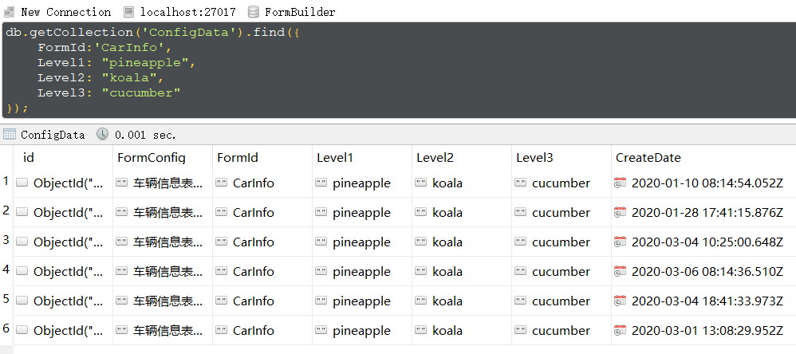
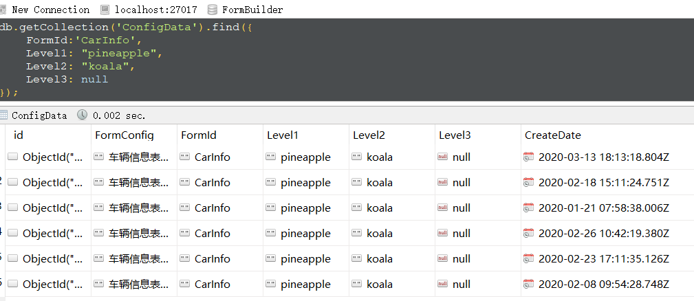
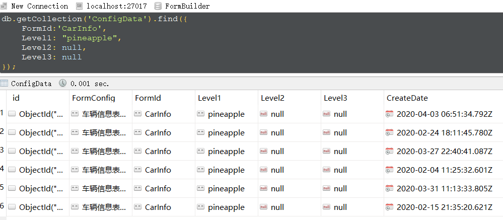
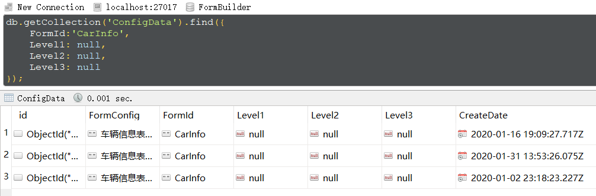
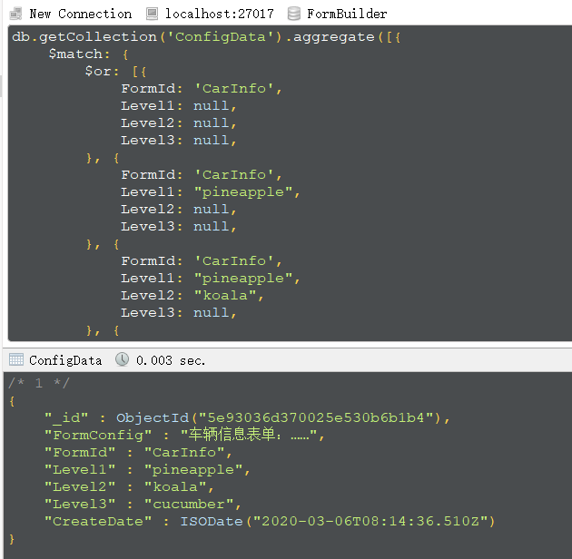
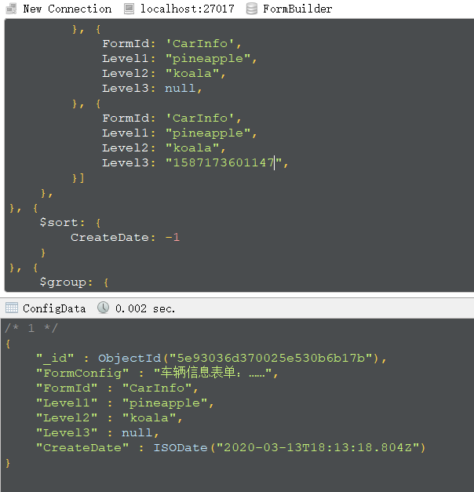
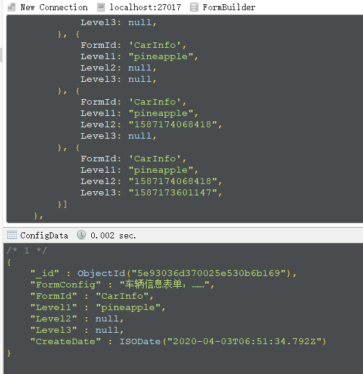
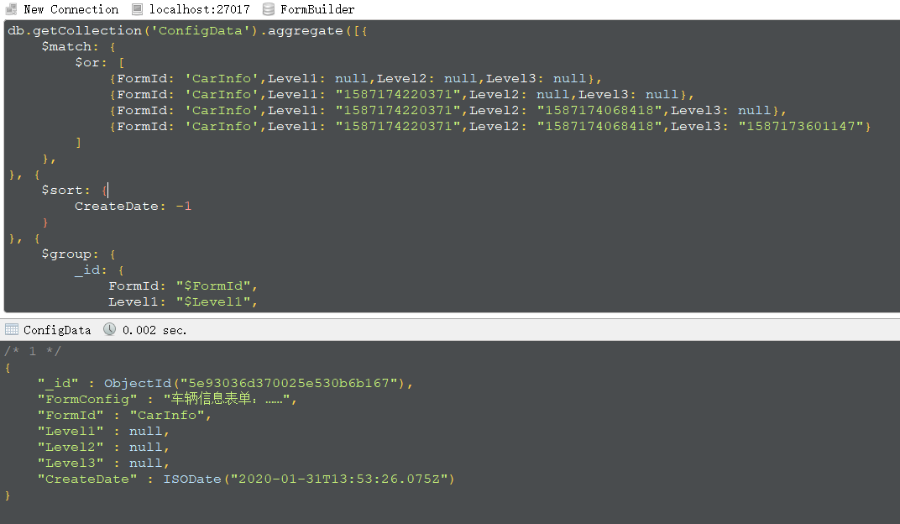
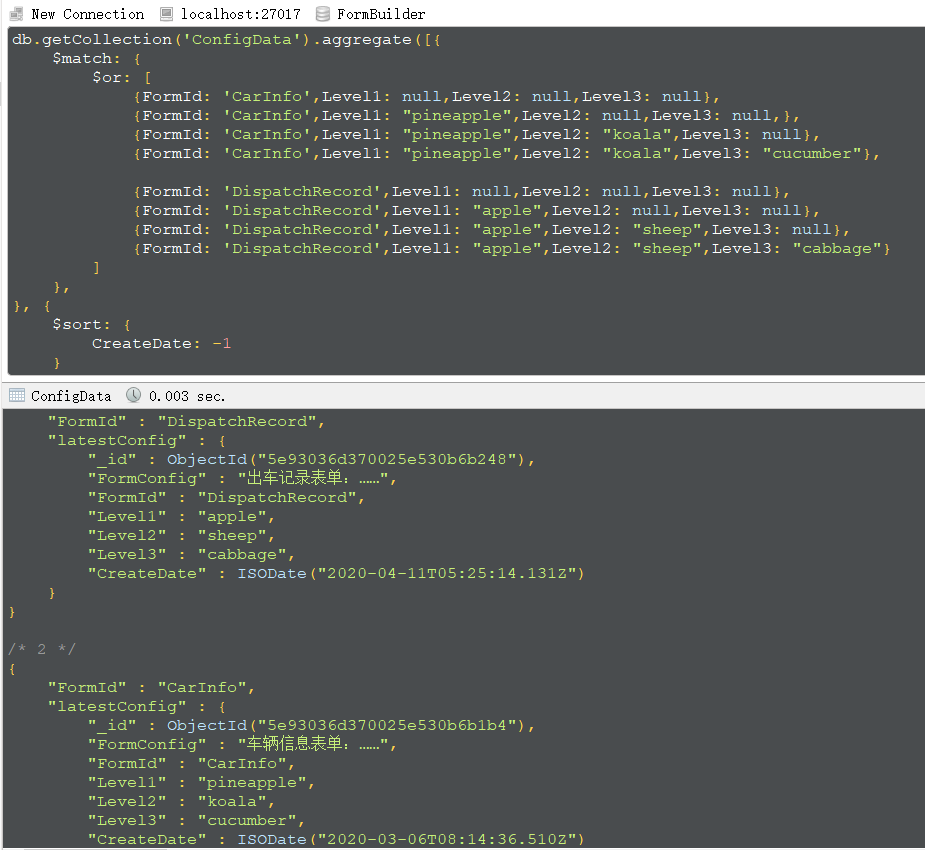
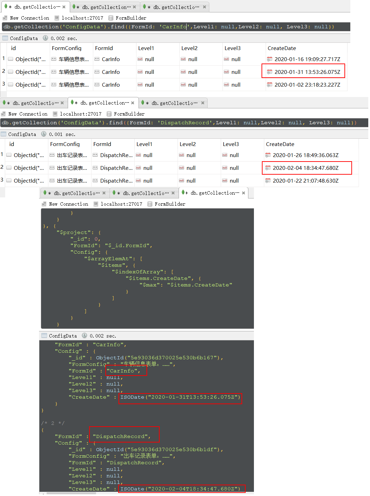

# 表单生成器(Form Builder)之mongodb查询表单最新配置  
表单生成器可以让我们快速的制作一个表单,我们还可以提供支持让用户自己配置导航、数据权限等,但是一个产品或者应用在上线的时候肯定要有一些东西,不能完全由用户去定制,因此我们会内置一些内容。为了提高产品的灵活性，我们也需要为用户提供良好的定制能力，来满足不同场景的不同需求(先不说定制导航，先说一下定制表单)。这里已经引出了两个概念：一个是出厂时的表单配置，另一个是用户定制的表单配置。 

上面的问题体现在数据库层面在说一下，同时也是这篇笔记记录的事情。每一个表单都有一个唯一标识，这里使用<code>FormId</code>,另外需要区分一下出厂的默认配置和用户定制，用户定制可能有好多个级别，例如：买产品的公司、下属的部门、部门中的员工……都可以定制，这里就暂时定义三个级别，于是最基本的表结构就出来了：
```json
{
    "_id" : "",//           主键ID(版本ID)
    "FormConfig" : "",//    这里存储表单的具体配置
    "FormId" : "",//        表单唯一表示
    "Level1" : null,//      第一层级参数，例如：公司层面
    "Level2" : null,//      第二层级参数，例如：部门层面
    "Level3" : null,//      第二层级参数，例如：员工（用户）层面
    "CreateDate" : ""//     创建时间
}
```  
再说一下FormId、Level2、Level2、Level3，具体的是怎么存值得：
* 默认：FormId="表单标识"、Level1=null、Level2=null、Level3=null
* 公司：FormId="表单标识"、Level1="公司标识"、Level2=null、Level3=null   
* 部门：FormId="表单标识"、Level1="公司标识"、Level2="部门标识"、Level3=null 
* 员工：FormId="表单标识"、Level1="公司标识"、Level2="部门标识"、Level3="用户ID"  

有了上面的结构，基本上满足了不同层级的定制需要。但是随着时间的推移、业务需求的改变可能需要在指定的表单配置中添加、删除、修改表单项，这时<code>FormId</code>和三个层级参数都是不变的，只是<code>FormConfig</code>变了，我们会生成一条新的记录，我们将这个叫做相同层级参数下的不同版本，<code>_id</code>还充当了版本ID的角色。说道这里设想表单配置方面已经介绍完毕，我们可以去新增、查看、编辑我们的数据了，那么我们该使用哪个级别的配置：默认、公司、部门、员工，又该怎么读取。我们那边是这样规定的：根据查询参数（FormId、Level2、Level2、Level3）查询当前层级的最新的表单配置，如果当前层级不存在则使用上一级别的最新配置。  

为了演示这个，首先准备一些数据。这里使用车辆信息、车辆耗损、车辆营收三个表单，之前在[表单生成器(Form Builder)之伪造表单数据mongodb篇](https://www.cnblogs.com/du-blog/p/11815545.html)提过。写了一些脚本来生成这三个表单的配置数据，脚本地址:[伪造数据](./init.js)。  

看一下生成的数据：   

  

在这些数据中选了一个，分别查一下四个层级(默认、公司、部门、个人)的配置。  

* 员工：FormId="CarInfo"、Level1="pineapple"、Level2="koala"、Level3="cucumber" 
    ```javascript
    db.getCollection('ConfigData').find({
        FormId:'CarInfo',
        Level1: "pineapple",
        Level2: "koala",
        Level3: "cucumber"
    });
    ```
    查询结果如下：  
      
* 部门：FormId="CarInfo"、Level1="pineapple"、Level2="koala"、Level3=null  
    ```javascript
    db.getCollection('ConfigData').find({
        FormId:'CarInfo',
        Level1: "pineapple",
        Level2: "koala",
        Level3: null
    });
    ```  
    查询结果如下：  
      
* 公司：FormId="CarInfo"、Level1="pineapple"、Level2=null、Level3=null  
    ```javascript
    db.getCollection('ConfigData').find({
        FormId:'CarInfo',
        Level1: "pineapple",
        Level2: null,
        Level3: null
    });
    ```  
    查询结果如下：  
      
* 默认：FormId="CarInfo"、Level1=null、Level2=null、Level3=null  
    ```javascript
    db.getCollection('ConfigData').find({
        FormId:'CarInfo',
        Level1: null,
        Level2: null,
        Level3: null
    });
    ```  
    查询结果如下：  
      

今天的主角来了，我们看一下是如何的查询，查询语句：[单个表单查询](./query-one.js)，看一下查询结果：  

 

上面的结果是当前层级存在的，并获取了最新的配置，下面分别修改一下查询参数,确保当前层级不存在去查询他的上一级：

* 员工级别查询不到，使用部门级别：FormId="CarInfo"、Level1="pineapple"、Level2="koala"、Level3="1587173601147"  

    查询结果如下：  
       
* 部门级别查询不到，使用公司级别：FormId="CarInfo"、Level1="pineapple"、Level2="1587174068418"、Level3="1587173601147"  

    查询结果如下：  
       
* 公司级别查询不到，使用默认级别：FormId="CarInfo"、Level1="1587174220371"、Level2="1587174068418"、Level3="1587173601147"  

    查询结果如下：  
         

可以对比一下，开始的查询不同层级的所有配置（不同的版本）与最后查出来的最新配置是否相同，我看了一下，没有什么问题。前面说了单个查询，后来了又有新的需求，有的时候需要一次查询多个，也就是批量查询，之前呢一直是循环调用上面的方法……也不是不行，就是觉得别扭，一直想着数据库层面的实现，后来想了一下，也不是特别麻烦，查询语句：[批量表单查询](./query-batch.js)，查看一下查询结果：  

  

到了这里这篇笔记就结束了。  

【2020-04-26更新】 

这个补充稍微和这篇笔记沾点边，我的同事也在弄这个批量查询，他将所有的配置都分组了，弄到了一个数组中，之后想要获取最新的一条记录……也就是想要获取数组内通过某一字段排序后的第一个，但是又不想使用$unwind。这个确实挺费劲的，查了好多也没有结果，不过最后，找到了一篇文章[https://xbuba.com/questions/36824601](https://xbuba.com/questions/36824601) ,这里使用的是$max,间接实现了排序的功能，看一下查询语句：[获取数组内的一条记录：$max](./query-array-inner-sort-by-max.js),再看一下截图：  

  