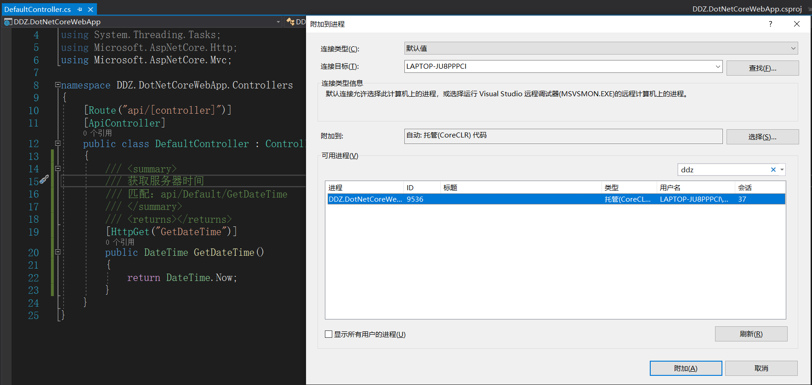

# 介绍  
创建一个Web API项目，前端Get、Post调用示例，并且可以调试……  
## 一、创建项目
项目模板：ASP.NET Core Web 应用程序（.Net Core + ASP.NET Core 3.1 + 空项目模板）
## 二、运行项目
### 1、在项目根目录打开CMD或者Powershell窗口,执行下面的命令
    dotnet run
   更多命令，你可以参考：[.NET Core CLI](https://docs.microsoft.com/zh-cn/dotnet/core/tools/)

   **注意：** 你可以安装[Open Command Line](https://marketplace.visualstudio.com/items?itemName=MadsKristensen.OpenCommandLine)插件，之后你就可以在Visual Studio直接打开了。  

   这时你就可以在浏览器中访问了，默认是：http://localhost:5000/ ，截图如下：  
   
   

### 2、如果你想修改了文件之后，实时编译，你可以使用
    dotnet watch run  
   更多关于他的介绍，你可以跳转：[Use a file watcher](https://docs.microsoft.com/zh-cn/aspnet/core/tutorials/dotnet-watch)  
   
   你修改了文件保存之后，他就会先退出之后重新执行，截图如下：  
   
     
## 三、添加静态文件支持
### 1、创建`wwwroot`目录并添加`index.html`文件
### 2、修改`Startup.cs`文件,在`Configure`方法中添加中间件组件，并且注释掉终结点里面的响应：
    app.UseDefaultFiles();
    app.UseStaticFiles();  
   **注意：** 他们两个顺序一定是这样的，否则页面加载不出来。     
   
   截图如下：  
   
   
## 四、添加控制器
### 1、创建`Controllers`文件夹，用来存放控制器
### 2、添加一个空控制器，这里为：`DefaultController`   
写一个获取服务器端时间的方法测试一下，这时候访问是访问不了的，还需要修改`Startup.cs`，截图如下：  

  
### 3、使用`dotnet run`时，如何调试  
快捷键`ctrl + alt + p`打开“附加到进程”窗口，在搜索框中输入你的项目的名称，如下图：  

    

选中项目对应的进程，点击附加即可，之后我们再刷新一下浏览器，如下图：

 
### 4、POST请求
* application/json  

    为了能够测试这个，分别修改了一下`DefaultController.cs`和`index.html`两个文件，不用添加其他的配置，默认是支持JSON的，测试结果：  
    
      
    
    
* application/x-www-form-urlencoded  
  
    继续修改上面的两个文件，测试结果：
    
      
    
      

    在这里翻车了，默认这种类型不支持……查了好多，开始以为类似XML需要在`Startup.cs`的方法中做一些配置，添加类似支持XML的配置，但是……；有的说CORS，但是……；还试了`Consumes("application/x-www-form-urlencoded")`,但是……；最后的结果竟然是将`[FromBody]`替换成`[FromForm]`就好了，截图如下：

      

      

    在这里说一下，公司中的项目采用的是`.NET Framework`，一直都是用`[FromBody]`接收的并且没有问题（当前不排除，项目做了一些其他的设置，至少我知道做了跨域的设置），但是现在在`.Net Core`下有问题……这个问题暂时就不说了，以后有时间在研究。不知道你有没有发现，我提交的是"      "(空格字符串),但是服务器端接收到的是`null`（JSON格式提交就没有这个问题）,其实这才是这篇笔记要说的问题，只不过之前一直使用`.NET Framework`，或者之前看了一点点`.NET Core`也忘了，所以呢乘着这个机会一边学一边记录，才有这篇笔记。  
    
    这个问题开始是我们老大解决的，告诉我在属性上添加`[DisplayFormat(ConvertEmptyStringToNull=false)]`就好了，确实是这样的，截图如下：  

      

      

    虽然解决的这个问题，但是每个类的字符创类型的属性上都添加该特性太麻烦了，能不能有一个全局的配置，顺着这条路就查了下去，下面的参考链接中找到了答案，解决了`.NET Framework`下的问题，代码如下：
    ```c#
    public class EmptyStringAllowedModelMetadataProvider : DataAnnotationsModelMetadataProvider
    {
        protected override CachedDataAnnotationsModelMetadata CreateMetadataFromPrototype(CachedDataAnnotationsModelMetadata prototype, Func<object> modelAccessor)
        {
            var metadata = base.CreateMetadataFromPrototype(prototype, modelAccessor);
            metadata.ConvertEmptyStringToNull = false;
            return metadata;
        }
        protected override CachedDataAnnotationsModelMetadata CreateMetadataPrototype(IEnumerable<Attribute> attributes, Type containerType, Type modelType, string propertyName)
        {
            var metadata = base.CreateMetadataPrototype(attributes, containerType, modelType, propertyName);
            metadata.ConvertEmptyStringToNull = false;
            return metadata;
        }
    }
    //***********
    config.Services.Replace(typeof(ModelMetadataProvider), new EmptyStringAllowedModelMetadataProvider());  
    ```  
    但是`.NET Core`下的这个问题不太好解决，顺着上面的思路，我也想自己实现一个`ModelMetadataProvider`,在一些类(例如：`DefaultModelMetadataProvider`)中发现了`ModelMetadata`这个类型的属性，该类中是有`ConvertEmptyStringToNull`属性的，于是就想着继承一下`DefaultModelMetadataProvider`这个，之后重写一下方法不就搞定了嘛！高兴的有点早了，`ModelMetadata`中的`ConvertEmptyStringToNull`属性是只读的……😭😭😭还好最后终于解决了，参考代码如下：
    ```c#
    public class Startup
    {
        // ...
        public void ConfigureServices(IServiceCollection services)
        {
            // ...
            services.AddMvc()
                .AddMvcOptions(o => o.ModelMetadataDetailsProviders.Add(new MyDeclarativeMetadataProvider()));
            // ...
        }
    }
    public class MyDeclarativeMetadataProvider : IMetadataDetailsProvider, IDisplayMetadataProvider
    {
        public void CreateDisplayMetadata(DisplayMetadataProviderContext context)
        {
            // Some logic to determine what metadata we're dealing with here, for example:
            if (context.Key.MetadataKind == ModelMetadataKind.Type)
            {
                // And that's how you set ConvertEmptyStringToNull
                context.DisplayMetadata.ConvertEmptyStringToNull = false;
            }
        }
    }
    ```  
    
    完全按照他的代码，还是不行，我修改了一下，把其中判断去掉就好了，截图如下：  

      

      

【官方文档】
* [ASP.NET 文档 | Microsoft Docs](https://docs.microsoft.com/zh-cn/aspnet/core)  

【参考网址-`.NET Framework`】
* [ASP.NET WebAPI passing empty string in urlencoded body as null](https://stackoverflow.com/questions/14521741/asp-net-webapi-passing-empty-string-in-urlencoded-body-as-null)  
* [Set default for DisplayFormatAttribute.ConvertEmptyStringToNull to false](https://stackoverflow.com/questions/20308201/set-default-for-displayformatattribute-convertemptystringtonull-to-false/36558116#36558116)  
* [ajax post提交空字符串(string.Empty) MVC接收为null的问题](https://www.cnblogs.com/dansediao/p/8253114.html)  

【参考网址-`.NET Core`】
* [ConvertEmptyStringToNull stopped being honored after upgrading from RC1 #4988](https://github.com/aspnet/Mvc/issues/4988)  
* [ASP.NET MVC 2 Templates, Part 2: ModelMetadata](https://bradwilson.typepad.com/blog/2009/10/aspnet-mvc-2-templates-part-2-modelmetadata.html)  

【其他】
* [ASP.Net MVC 4.0 - Default Model Binder converts empty string to null. Work around - custom binder no longer functions.](https://forums.asp.net/t/1934436.aspx?ASP+Net+MVC+4+0+Default+Model+Binder+converts+empty+string+to+null+Work+around+custom+binder+no+longer+functions+)   