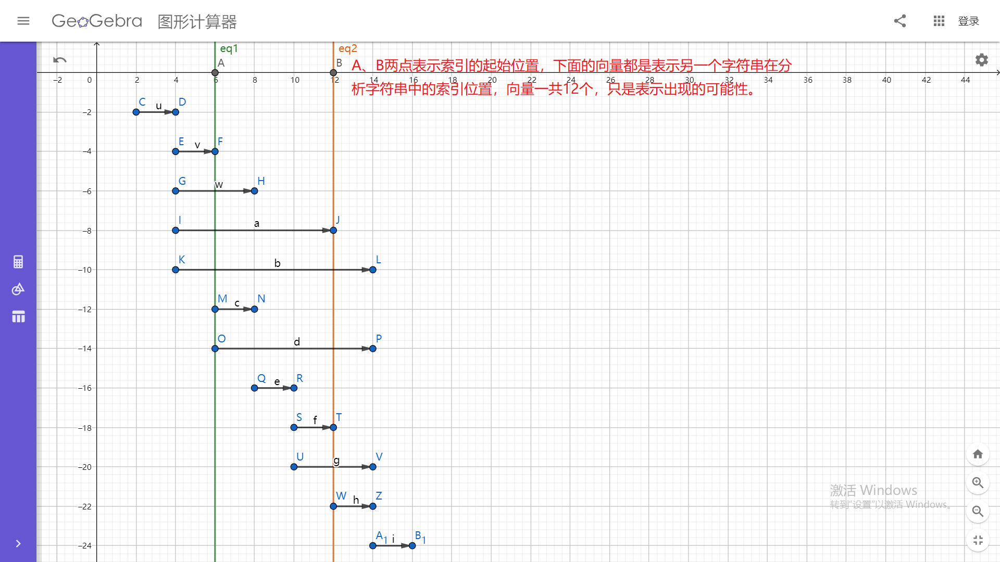

# 记一次解析字符串：在目标字符串中找出指定的N个字符串所在的起始位置
我们的项目上有一个这样的场景：一个下拉选择框，同时要支持用户输入，将最终的结果显示在文本框中（就是普通的字符串，用户在下拉框中选择的放在【】中）……不知道能不能想象出来，写上一篇笔记的时候发现和咱们博客园选择“tag 标签”的功能有点接近啊，我们的ui还是跟她有些不同。  

还是拿一个具体的例子说一下吧。下拉框中有“姓名”、“年龄”两个选择项，你可以选择也可以自己在文本框中输入，例如文本框中的内容是：自定义001【姓名】自定义002【年龄】自定义003。我们要做的就是解析这个字符串，我们需要识别出其中的“姓名”和“年龄”（无论是用户选择的，还是用户输入的），最后的结果应该是这样的 ["自定义001","【姓名】","自定义002","【年龄】","自定义003"]。  

这里还要在补充一点他们的要求：就是可以同时匹配多个时候（开始的索引位置相同，但是结尾不同），我们需要识别下拉列表中的第一个。有点抽象，还是说一个例子吧。这里下拉列表中有“姓名】”和“姓名”两个，这时候文本框中的内容是：自定义001【姓名】】自定义002。交换下拉列表中的顺序，最终得到的结果是不一样的。  

说了这么一大推，感觉好没意思啊！其实还是蛮有意思的（解析这个）。遇到这个问题之后最先想到的就是，遍历下拉框数组，利用indexOf查找看看有没有，之后截取三部分（前面的、自己、后面的），之后递归处理前面和后面的部分。我去，想着简单但是写的时候好费劲啊！最后查了一下，看看有没有这种方法，在目标字符串中找出指定的N个字符串的所在起始位置，一个方法可以搞定的那种，最后还是正则表达式救了我。现在我可以得到下拉选项中的每一项在目标字符串的起始位置了，剩下的就是利用这些起始位置去截取目标字符串了，脑袋一热将这些这些索引位置放到一个数组中（去重），之后排序，之后两两已截取不就完了，这样写完之后就真的凉凉了，很多字符串都解析错误，之后弄了好几版都不行，决定静下来分析一下，看看到底有多少种情况。之前竟然还想到数据去重（确实是第一次写就去重了），但是就没有想想什么情况下有重复的情况出现：索引开始相同，某一个的索引结束是另一个的开始……后来我直接画图了，列出了12中情况，在下面可以在纸上画，这里呢？我也又找到了一个神器：图形计算器，你看一下：

  

一共有12中情况，要是一个一个if else 太费劲了，细看一下发现中间的8种情况是有问题的，如果将这8种情况下的起始索引都放到数组中去截取字串，那么他就会将下拉框中的下拉项（也就是图中两个中的一个截断），所以呢用了一下排除法。之后呢，为了验证我也列举了上面的6中情况（下面分别给出例子），感觉前面的6个和后面的6个是对称的……  

```javascript
//    参考：
//        https://developer.mozilla.org/zh-CN/docs/Web/JavaScript/Reference/Global_Objects/RegExp/@@matchAll
//        https://developer.mozilla.org/zh-CN/docs/Web/JavaScript/Reference/Global_Objects/String/matchAll
//    待选列表（下拉列表项）
var toBeSelectedList = [{
    dispalyName: "姓名",
    dispalyIndex: "name1"
}, {
    dispalyName: "年龄",
    dispalyIndex: "age"
}, {
    dispalyName: "姓【名",
    dispalyIndex: "name2"
}, {
    dispalyName: "名】001",
    dispalyIndex: "name3"
}, {
    dispalyName: "【姓名",
    dispalyIndex: "name4"
}, {
    dispalyName: "1【姓名】1",
    dispalyIndex: "name5"
}, {
    dispalyName: "姓名】",
    dispalyIndex: "name6"
}];
var tempDispalyNameArr = toBeSelectedList.map(function (item) {
    return item.dispalyName;
});

//    解析方法
var getTargetArrByUserInputAndFilterStrs = function (userInputStr, filterStrs) {
    var tempIndexPosArr = [],
        tempIndexPosObjArr = [],
        tempFilterStrAddCharObj = {};
    filterStrs.forEach(function (filterStr, index) {
        var tempKey = '【' + filterStr + '】',
            tempRegexp = new RegExp(tempKey, 'g'),
            match;
        tempFilterStrAddCharObj[tempKey] = filterStr;
        while ((match = tempRegexp.exec(userInputStr)) !== null) {
            var tempFilterPosArrs = tempIndexPosObjArr.filter(function (startAndLastIndexItem) {
                // return (match.index >= startAndLastIndexItem.index && match.index < startAndLastIndexItem.lastIndex) ||
                // (match.index < startAndLastIndexItem.index && tempRegexp.lastIndex >= startAndLastIndexItem.lastIndex);
                return !(tempRegexp.lastIndex <= startAndLastIndexItem.index || match.index >= startAndLastIndexItem.lastIndex);
            });
            if (tempFilterPosArrs.length === 0) {
                tempIndexPosObjArr.push({
                    index: match.index,
                    lastIndex: tempRegexp.lastIndex
                });
            }
        }
    });
    tempIndexPosObjArr.forEach(function (indexObj) {
        if (tempIndexPosArr.indexOf(indexObj.index) < 0) {
            tempIndexPosArr.push(indexObj.index);
        }
        if (tempIndexPosArr.indexOf(indexObj.lastIndex) < 0) {
            tempIndexPosArr.push(indexObj.lastIndex);
        }
    });
    if (tempIndexPosArr.indexOf(0) < 0) {
        tempIndexPosArr.push(0);
    }
    if (tempIndexPosArr.indexOf(userInputStr.length) < 0) {
        tempIndexPosArr.push(userInputStr.length);
    }
    tempIndexPosArr = tempIndexPosArr.sort(function (a, b) {
        return a - b;
    });

    var lastNeedArr = [];
    tempIndexPosArr.forEach(function (posIndex, index) {
        if (index < tempIndexPosArr.length - 1) {
            var tempIsOneFilterStr = userInputStr.substring(posIndex, tempIndexPosArr[index + 1]);
            // if(tempFilterStrAddCharObj.hasOwnProperty(tempIsOneFilterStr)){
            // tempIsOneFilterStr=tempFilterStrAddCharObj[tempIsOneFilterStr]
            // }
            lastNeedArr.push(tempIsOneFilterStr);
        }
    });
    return lastNeedArr;
};
//    等待解析的字符串（也就是用户选择或者输入的最终结果）

var waitAnalysisStr1 = "自定义001【姓名】自定义002【年龄】自定义003";
var toBeSelectedList1_1 = ["姓名", "年龄"]; //    ["自定义001","【姓名】","自定义002","【年龄】","自定义003"]
var toBeSelectedList1_2 = ["年龄", "姓名"]; //    ["自定义001","【姓名】","自定义002","【年龄】","自定义003"]

var waitAnalysisStr2 = "自定义001【姓名】【年龄】自定义002";
var toBeSelectedList2_1 = ["姓名", "年龄"]; //    ["自定义001","【姓名】","【年龄】","自定义002"]
var toBeSelectedList2_2 = ["年龄", "姓名"]; //    ["自定义001","【姓名】","【年龄】","自定义002"]

var waitAnalysisStr3 = "自定义001【姓【名】001】自定义002";
var toBeSelectedList3_1 = ["姓【名", "名】001"]; //    ["自定义001","【姓【名】","001】自定义002"]
var toBeSelectedList3_2 = ["名】001", "姓【名"]; //    ["自定义001【姓","【名】001】","自定义002"]  

var waitAnalysisStr4 = "自定义001【【姓名】自定义002"; //    【姓名 、 姓名    交换顺序试试
var toBeSelectedList4_1 = ["【姓名", "姓名"]; //    ["自定义001","【【姓名】","自定义002"]
var toBeSelectedList4_2 = ["姓名", "【姓名"]; //    ["自定义001【","【姓名】","自定义002"]

var waitAnalysisStr5 = "自定义001【1【姓名】1】自定义002"; //    1【姓名】1 、 姓名    交换顺序试试
var toBeSelectedList5_1 = ["1【姓名】1", "姓名"]; //    ["自定义001","【1【姓名】1】","自定义002"]
var toBeSelectedList5_2 = ["姓名", "1【姓名】1"]; //    ["自定义001【1","【姓名】","1】自定义002"]

var waitAnalysisStr6 = "自定义001【姓名】】自定义002"; //    姓名 、 姓名】    交换顺序试试
var toBeSelectedList6_1 = ["姓名】", "姓名"]; //    ["自定义001","【姓名】】","自定义002"]
var toBeSelectedList6_2 = ["姓名", "姓名】"]; //    ["自定义001","【姓名】","】自定义002"]

var tempTargetArr1_1 = getTargetArrByUserInputAndFilterStrs(waitAnalysisStr1, toBeSelectedList1_1);
console.log(JSON.stringify(tempTargetArr1_1));
var tempTargetArr1_2 = getTargetArrByUserInputAndFilterStrs(waitAnalysisStr1, toBeSelectedList1_2);
console.log(JSON.stringify(tempTargetArr1_2));

var tempTargetArr2_1 = getTargetArrByUserInputAndFilterStrs(waitAnalysisStr2, toBeSelectedList2_1);
console.log(JSON.stringify(tempTargetArr2_1));
var tempTargetArr2_2 = getTargetArrByUserInputAndFilterStrs(waitAnalysisStr2, toBeSelectedList2_2);
console.log(JSON.stringify(tempTargetArr2_2));

var tempTargetArr3_1 = getTargetArrByUserInputAndFilterStrs(waitAnalysisStr3, toBeSelectedList3_1);
console.log(JSON.stringify(tempTargetArr3_1));
var tempTargetArr3_2 = getTargetArrByUserInputAndFilterStrs(waitAnalysisStr3, toBeSelectedList3_2);
console.log(JSON.stringify(tempTargetArr3_2));

var tempTargetArr4_1 = getTargetArrByUserInputAndFilterStrs(waitAnalysisStr4, toBeSelectedList4_1);
console.log(JSON.stringify(tempTargetArr4_1));
var tempTargetArr4_2 = getTargetArrByUserInputAndFilterStrs(waitAnalysisStr4, toBeSelectedList4_2);
console.log(JSON.stringify(tempTargetArr4_2));

var tempTargetArr5_1 = getTargetArrByUserInputAndFilterStrs(waitAnalysisStr5, toBeSelectedList5_1);
console.log(JSON.stringify(tempTargetArr5_1));
var tempTargetArr5_2 = getTargetArrByUserInputAndFilterStrs(waitAnalysisStr5, toBeSelectedList5_2);
console.log(JSON.stringify(tempTargetArr5_2));

var tempTargetArr6_1 = getTargetArrByUserInputAndFilterStrs(waitAnalysisStr6, toBeSelectedList6_1);
console.log(JSON.stringify(tempTargetArr6_1));
var tempTargetArr6_2 = getTargetArrByUserInputAndFilterStrs(waitAnalysisStr6, toBeSelectedList6_2);
console.log(JSON.stringify(tempTargetArr6_2));
```  

其实到现在，都不知道现在的算法是不是包住了所有情况，虽然下面的例子都测试通过了，还是等着真正的测试人员去测试吧！如果哪位大神有更好的方法请赐教，谢谢！